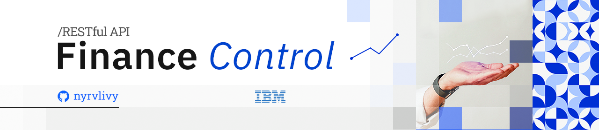

<div align="center">
  
</div>

<h1 align="center">Finance Control API</h1>
<p align="center">Backend Development Project: Building a Java RESTful API with Spring Boot for Financial Transaction Management.</p>

<div align="center">


</div>

##

## Table of contents

* [Project Description](#project-description)
* [How to Setup?](#how-to-setup)
* [Endpoints](#endpoints)
    <details>
    <summary>Click to expand</summary>

    - [Find All Transactions](#find-all-transactions)
    - [Create Transaction](#create-transaction)
    - [Update Transaction](#update-transaction)
    - [Delete Transaction](#delete-transaction)
    - [Filter by Date](#filter-by-date)
    - [Filter by Category](#filter-by-category)

  </details>

##

## Project Description

This project is a **Java RESTful API**, built with **Spring Boot** for financial transaction management. It features batch and
individual transaction handling, CRUD operations, and date-based data filtering. The API is integrated with an Angular web
application for a seamless user experience. The system is designed to manage transactions efficiently, providing a robust platform
for financial data processing.

##

## How to Setup?

- [x] Fork this repository to your GitHub;
- [ ] Clone your repository to your machine;

```bash
    git clone https://github.com/your-user/finance-control-api.git
```

#### Set up your development environment:

- [ ] Make sure you have [Java](https://www.oracle.com/java/technologies/javase-downloads.html)
  and [Maven](https://maven.apache.org/download.cgi) installed on your machine.
- [ ] Open the terminal of your preferred IDE. Navigate to the project's root directory and build the project with Maven.

```bash
    cd finance-control-api
    mvn clean install
```

- [ ] Run the application using Spring Boot.

```bash
        mvn spring-boot:run
```

- [ ] Access the API documentation via your localhost: `<your_port>/swagger-ui.html`.
- [ ] Access the API endpoints via your localhost: `<your_port>/api/v1/transactions`.
- [ ] And enjoy it! 🎊👏

##

## Endpoints

You can interact with the RESTful API using the following endpoints:

<details>
<summary>Click to expand</summary>

### Find All Transactions

Retrieve a list of all transactions or filter transactions by date and/or category.

```bash
    GET localhost:8080/transactions?date=<yyyy-MM-dd>&category=<category>
```

### Create Transaction

Add new transactions to the system.

```bash
    POST localhost:8080/transactions
```

Provide transaction details in the request body as per the example below:

```json
{
  "date": "2025-01-01",
  "value": 100.00,
  "category": "Food"
}
```

### Update Transaction

Update existing transaction details by transaction ID.

```bash
    PUT localhost:8080/transactions/{id}
```

Include updated transaction information in the request body.

```json
{
  "date": "2025-01-01",
  "value": 150.00,
  "category": "Games"
}
```

### Delete Transaction

Remove a transaction from the system using its ID.

```bash
    DELETE localhost:8080/transactions/{id}
```

### Filter by Date

Retrieve transactions filtered by a specific date.

```bash
    GET localhost:8080/transactions?date=<yyyy-MM-dd>
```

### Filter by Category

Retrieve transactions filtered by a specific category.

```bash
    GET localhost:8080/transactions?category=<category>
```
</details>

##

## Documentation

Explore the comprehensive API documentation for in-depth insights into the project functionalities. Access the complete API
documentation by navigating to [http://localhost:8181/swagger-ui.html](http://localhost:8181/swagger-ui.html) or via your
localhost: `<your_port>/swagger-ui.html`.

The documentation provides detailed information about each endpoint, including request methods, expected parameters, and sample
responses. It serves as a valuable resource for developers, offering a clear understanding of how to interact with the PDV System
REST API effectively.

Feel free to use this documentation as a guide while developing and testing your applications. If you encounter any issues or have
suggestions for improvement, please don't hesitate to reach out. We appreciate your collaboration in making the PDV System API
even better!

##

<div align="center">

**Finally, I would like to mention that this project is just the beginning! Soon, we will have new features and better
organization, including the implementation of a real database.**

</div>

##

###### tags: `Java` `Spring Boot` `RESTful API` `CRUD` `JPA` `Maven` `JDBC` `Hibernate` `Mockito` `JUnit` `CORS`  `mysql` `dotenv` `API Documentation (Swagger)`

<div align="center">
  
</div>

